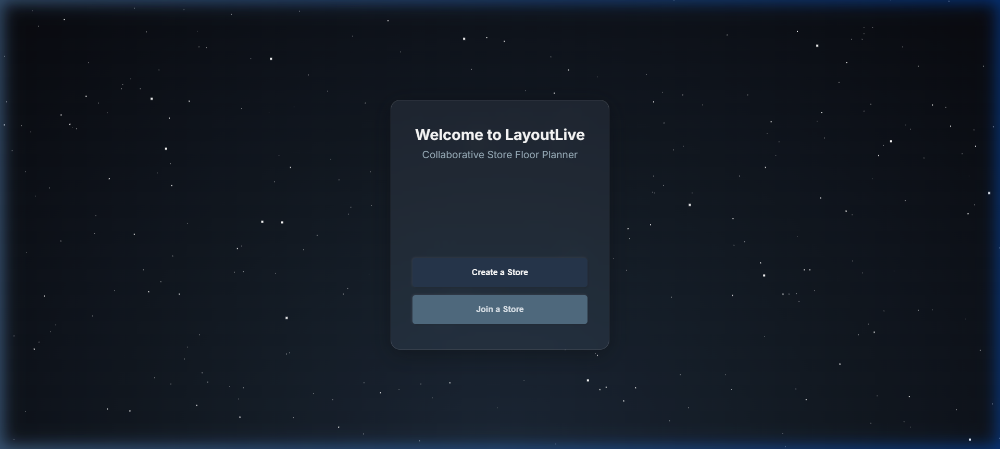
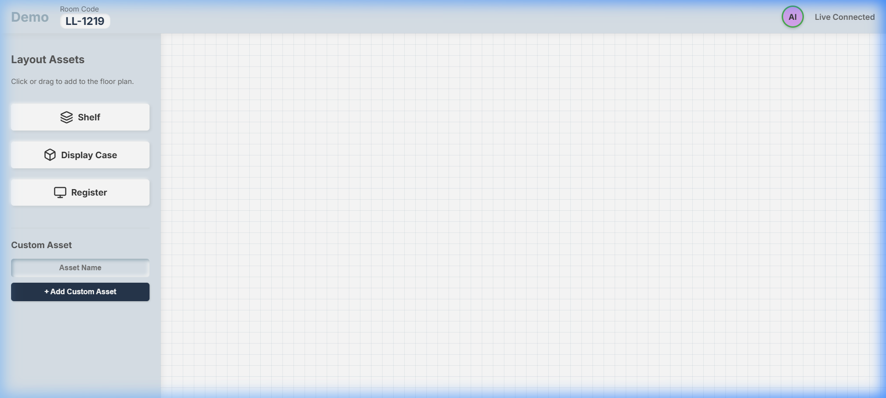

# LayoutLive - Collaborative Store Floor Planner

LayoutLive is a real-time collaborative web application designed to help teams easily plan and structure retail floor plans in a shared virtual workspace.

## Features
- **Real-time Syncing**: Place, move, and rotate layout fixtures instantly across all connected devices using WebSockets.
- **Store Lobby & Rooms**: Generate secure room codes with passwords to ensure private collaboration.
- **Glassmorphism Design**: Enjoy a premium Slate Blue and Ice Grey aesthetic with dynamic parallax starfield backgrounds.
- **Transform Gizmos**: Utilize advanced 3D-software-style interactive bounding boxes to scale and align shelves and registers perfectly.

## Screenshots

### Lobby View

### Canvas View

## Getting Started

1. `npm install`
2. `npm run dev` (Runs both Vite frontend and Express Socket.io backend concurrently)
